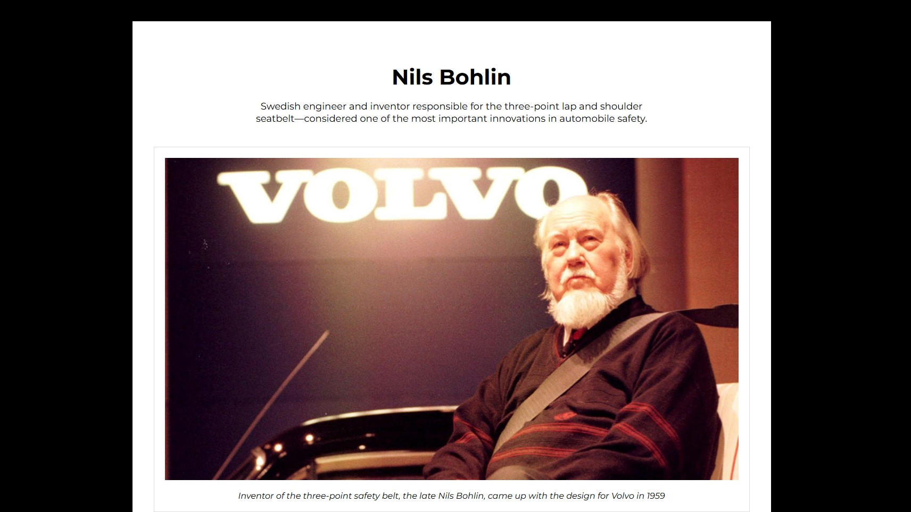

# Tribute Page

## Preview



## Description

Tribute page dedicated to Nils Bohlin - the Swedish engineer who invented the modern three-point seatbelt.
This project was built as part of the **["Tribute-page"](https://www.freecodecamp.org/learn/2022/responsive-web-design/build-a-tribute-page-project/build-a-tribute-page)** assignment in the **[Legacy Responsive Web Design V8](https://www.freecodecamp.org/learn/2022/responsive-web-design/)** course on **[freeCodeCamp](https://www.freecodecamp.org/)**.

## Technologies Used

- HTML5
- CSS3
- Git & GitHub
- Command Line
- Visual Studio Code

## Project Structure

```
fcc-tribute-page/
├─ README.md
├─ index.html
├─ css/
│  └─ styles.css
├─ assets/
│  └─ images/
│     └─ (other images...)
└─ preview.jpg
```

## Installation

1.  **Clone the repository**

    ```sh
    git clone https://github.com/yevgengvr/fcc-tribute-page.git
    ```

2.  **Navigate to the project directory**
    ```sh
    cd fcc-tribute-page
    ```

## Usage

Open the `index.html` file in your web browser. You can do this by double-clicking the file in your file explorer or by using your IDE's live server extension.

## Acknowledgments
- [freeCodeCamp](https://www.freecodecamp.org/) curriculum team
- Main information - [Volvo Group](https://www.volvogroup.com/en/)
- Article about the invention and Nils Bohlin [The New Economy](https://www.theneweconomy.com/technology/how-nils-bohlin-invented-the-three-point-safety-belt)
- Photo by <a href="https://unsplash.com/@louistricot?utm_source=unsplash&utm_medium=referral&utm_content=creditCopyText">louis tricot</a> on <a href="https://unsplash.com/photos/a-volvo-emblem-on-the-front-of-a-car-0BM8hXdsn_k?utm_source=unsplash&utm_medium=referral&utm_content=creditCopyText">Unsplash</a>

## Project Links

**[Live Preview](https://yevgengvr.github.io/fcc-tribute-page/)** and **[Source](https://github.com/yevgengvr/fcc-tribute-page)**.
